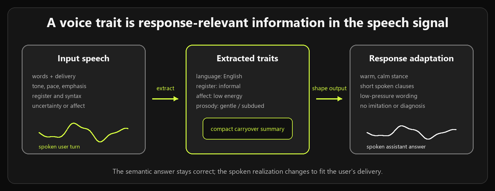
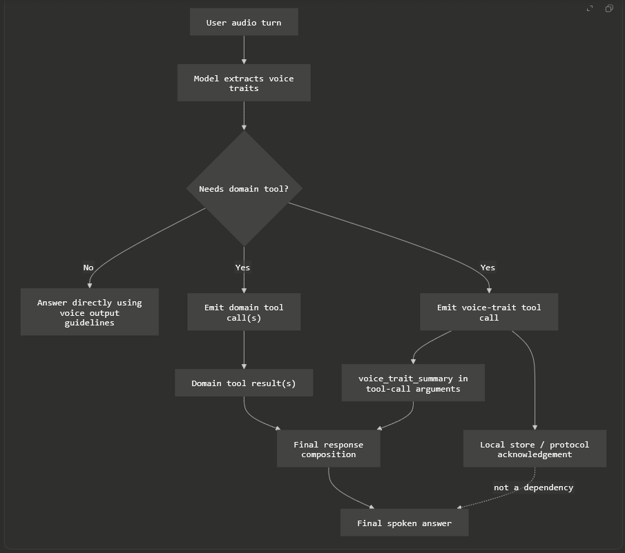
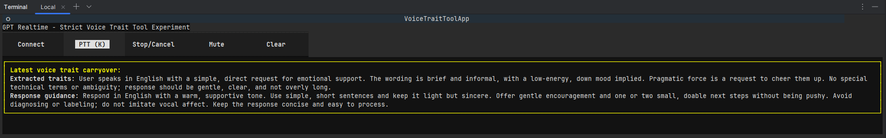

# Voice Trait Carryover for Realtime Speech Agents



> A small experiment around a subtle failure mode in speech-to-speech LLM systems: the assistant can adapt to the way a user speaks, but that adaptation can disappear when a tool-call boundary interrupts the turn.



## Local Experiment Snapshot

The screenshot below shows the standalone forced-tool experiment running locally. The yellow panel is the visible inspection surface for the ancillary carryover object. In this run, the user asked for emotional support in a brief, low-energy style. Before the final spoken answer, the model externalized two pieces of carryover state:

- an extracted trait summary: English, informal, direct request for emotional support, low-energy/down mood implied, no special technical terms or ambiguity;
- a response guidance summary: respond in English with warm, supportive wording, short sentences, gentle encouragement, and no imitation or diagnosis of vocal affect.



## The Short Version

Speech assistants do not only respond to words. They respond to spoken language.

A user can ask the same semantic question in many different ways: rushed, hesitant, formal, sad, frustrated, low-energy, playful, uncertain, clipped, careful, technical, or emotionally loaded. A capable realtime model can often hear those traits and shape its spoken answer accordingly when no tool call is needed.

But if the answer requires a tool call, the model has to pause its response, emit function calls, wait for tool results, and then resume. That boundary can cause an important piece of the original spoken input to fade from the model's active response context:

- the user's register,
- the user's affective stance,
- the user's pace,
- the user's uncertainty,
- the user's pragmatic force,
- the user's prosodic emphasis,
- the user's need for a calm, direct, gentle, concise, or technically precise response.

This repository explores a simple preservation pattern:

1. Extract response-relevant voice and speech traits from the latest spoken user turn.
2. If a tool call interrupts the answer, emit one ancillary carryover tool call first.
3. Store two compact summaries in that tool call's arguments:
   - `extracted_traits_summary`
   - `response_to_extracted_traits_summary`
4. Execute or echo that tool without adding a separate model turn.
5. Let the final answer after domain tool results use the carried-over response guidance.

The key idea is not the particular tool name. The key idea is that a speech trait state can be made explicit at the exact point where realtime tool orchestration would otherwise interrupt it.

## Target Model And API Surface

This experiment targets GPT Realtime-style speech agents: low-latency, speech-in/speech-out models that can also emit tool calls while maintaining a stateful realtime session.

The concrete model family I had in mind while building this is OpenAI/Azure GPT Realtime:

- OpenAI's Realtime conversation guide describes calling a Realtime model such as `gpt-realtime-2` for speech-to-speech conversations, and says the same session event flow covers audio/text generation, image input, function calling, and session state. See [OpenAI Realtime conversations](https://developers.openai.com/api/docs/guides/realtime-conversations).
- OpenAI's Realtime overview says voice-agent sessions are for assistants that respond to the user, call tools, and manage conversation state; the client sends audio or text and listens for model responses, tool calls, and session events. See [OpenAI Realtime and audio](https://developers.openai.com/api/docs/guides/realtime).
- Azure's GPT Realtime documentation describes GPT Realtime as part of the GPT-4o model family for low-latency "speech in, speech out" conversational interactions, lists `gpt-realtime` among supported models, and describes use with WebRTC, SIP, and WebSocket. See [Azure OpenAI GPT Realtime API for speech and audio](https://learn.microsoft.com/en-us/azure/foundry/openai/how-to/realtime-audio).
- OpenAI's function-calling guide describes tool calling as a multi-step flow: the model emits a tool call, application code executes it, tool output is returned, and the model then produces a final response. See [OpenAI function calling](https://developers.openai.com/api/docs/guides/function-calling).

The docs above establish the ingredients: realtime speech, stateful sessions, model-generated responses, and tool/function calls. This repository focuses on a behavior observed while experimenting with that class of system: speech-adaptive response style can be strong in a direct no-tool answer, but weaker or lost after a function-call interruption unless the response-relevant voice traits are explicitly carried across the boundary.

So the repo is not claiming that OpenAI or Azure documents this as a named bug. It is an engineering pattern for a real failure mode that appears when speech-to-speech response adaptation meets tool-calling orchestration.

## The Problem

In a direct speech-to-speech turn, a realtime model may hear:

- the user's language,
- register,
- syntactic complexity,
- information need,
- frustration,
- sadness,
- uncertainty,
- urgency,
- prosodic emphasis,
- tempo,
- articulation,
- low energy,
- or other response-relevant properties.

If the answer is direct, the model can immediately realize a response with the right shape:

- gentle and low-pressure for subdued or sad input,
- concise and direct for rushed input,
- precise for technical input,
- steady and bounded for angry input,
- simple and concrete for overwhelmed input.

The difficulty appears when the assistant must use a tool.

Example:

```text
User speaks, softly and tiredly:
"Could you check the weather in Berlin for me?"
```

The semantic request is simple: weather in Berlin.

But the spoken form matters. The final answer should probably not be loud, verbose, playful, or overloaded. It should be calm, brief, and easy to hear.

If the model immediately answers from speech, it can do this. If the model must call `get_current_weather(city)`, the response is interrupted. The final answer might be produced after a tool result, in a different model step, with weaker access to the original vocal delivery.

The tool result says something like:

```json
{
  "city": "Berlin",
  "temperature": "18 C",
  "condition": "light rain"
}
```

That result does not carry the user's voice. It carries domain data.

The missing question is:

> How does the final spoken answer remember how the user spoke?

## The Carryover Pattern

This experiment introduces an ancillary tool:

```text
store_voice_traits_summary_and_response(
  extracted_traits_summary,
  response_to_extracted_traits_summary
)
```

It is not a domain tool. It does not get weather, send messages, start navigation, or search the web.

It exists to preserve response-realization context across a tool-call boundary.

### Argument 1: `extracted_traits_summary`

A compact linguistic summary of the latest user's response-relevant speech traits.

Examples of the kinds of traits it may mention:

- language choice,
- code-switching,
- register,
- lexical density,
- syntactic complexity,
- semantic framing,
- pragmatic force,
- discourse function,
- information structure,
- epistemic stance,
- affective or interactional stance,
- prosodic focus,
- tempo,
- pause structure,
- articulation,
- phonation,
- paralinguistic cues,
- intelligibility or transcription uncertainty.

It should not infer identity, diagnosis, protected attributes, or private mental states.

### Argument 2: `response_to_extracted_traits_summary`

A compact linguistic summary of how the final spoken answer should respond to those traits.

Examples:

- "Respond in English with calm, low-pressure wording."
- "Keep the response concise, with short clauses and no optional detail."
- "Use precise technical terminology but avoid dense explanation."
- "Stay steady and bounded; do not mirror anger."
- "Use gentle phrasing and a small concrete next step."

The argument is not the final answer. It is response guidance.

## Why A Tool Call?

In a stateful realtime API, the model-generated tool call object itself becomes part of the conversation state. That matters.

The carryover artifact is not really the tool's side effect. It is the argument object produced by the model before the interruption.

The host can still return a no-op protocol echo:

```json
{
  "extracted_traits_summary": "...",
  "response_to_extracted_traits_summary": "..."
}
```

That satisfies function-call protocol requirements without requiring this ancillary tool to block domain tool execution.

The important part is scheduling:

- If no domain tool is needed, no carryover tool is needed.
- If a domain tool is needed, emit the carryover tool in the same batch.
- Put the carryover tool first.
- Execute domain tools normally.
- Do not create a separate follow-up response just for the carryover tool.
- Use the carried-over guidance in the final answer after domain results arrive.

This repository deliberately does not publish the full proprietary scheduling core that motivated the experiment. The general idea is a mathematically modeled low-latency scheduling policy: ancillary preservation calls should not serialize independent domain work and should not add unnecessary LLM turns.

## Why This Is Not Just Sentiment Analysis

The goal is not to classify the user as "sad", "angry", or "happy" and then attach a canned response.

The goal is response realization.

That means using the speech signal to decide:

- what language to answer in,
- how formal to be,
- how long the clauses should be,
- whether to use dense terminology,
- whether to answer first or soften first,
- whether to sound warm, neutral, direct, careful, or calming,
- whether a correction should be foregrounded,
- whether prosodic emphasis should shape word order,
- whether the user needs a small next step instead of a large explanation.

This is closer to spoken discourse adaptation than to emotion labeling.

## Research Grounding

This experiment is informed by several research areas. The repository does not claim to solve all of them. It uses them as motivation for a practical engineering pattern.

### Communication Accommodation

Communication Accommodation Theory studies how speakers adjust communicative behavior during interaction. It is useful here because the assistant should sometimes converge toward the user's communicative style: more concise, more formal, more technical, warmer, calmer, or more direct.

But accommodation has a boundary. Over-accommodation can feel patronizing or mocking. A speech assistant should adapt broad communicative properties, not imitate identity-linked features such as accent, voice quality, or dysfluency.

Useful sources:

- [Communication Accommodation Theory overview](https://pressbooks.montgomerycollege.edu/commtheory/chapter/chapter-19-communication-accommodation-theory/)
- [Communication accommodation theory, background and convergence/divergence](https://en.wikipedia.org/wiki/Communication_accommodation_theory)

### Prosody And Pragmatics

Prosody carries information about questionhood, emphasis, contrast, uncertainty, turn completion, and urgency. Pitch, rhythm, loudness, stress, phrasing, and pauses can all influence how a spoken utterance should be interpreted and answered.

In this experiment, prosody is not used for imitation. It is used for response shape:

- strong contrastive stress -> preserve the contrast early,
- rising contour with uncertainty -> answer with calibrated confidence,
- rushed tempo -> reduce optional detail,
- low-energy delivery -> reduce cognitive load,
- forceful delivery -> stay steady rather than forceful.

Useful sources:

- [Prosody in linguistics](https://en.wikipedia.org/wiki/Prosody_%28linguistics%29)
- [The Prosody of Turn-Taking and Dialog Acts](https://www.cs.utep.edu/nigel/prosody2006/)
- [Survey of turn-taking modeling in spoken dialogue systems](https://aclanthology.org/2025.iwsds-1.27.pdf)

### Emotion-Aware And Empathetic Voice Assistants

Emotion-aware voice assistant research explores how systems can respond more appropriately to affective signals in speech. The important lesson for this experiment is that affective adaptation should be helpful and bounded.

If the user sounds sad, the assistant should not theatrically become sad. It should use calm, gentle, low-pressure wording.

If the user sounds frustrated, the assistant should not defend itself. It should reduce friction and move quickly to the actionable point.

If the user sounds anxious, the assistant should make uncertainty and next steps easy to parse.

Useful sources:

- [Towards Empathetically Responsive Voice Assistants](https://dl.acm.org/doi/fullHtml/10.1145/3638380.3638398)
- [Emotion-aware voice assistants role-swapping study](https://arxiv.org/html/2502.15367v1)
- [Emotion-Aware Voice Interfaces Based on Speech Signal Processing](https://edoc.ub.uni-muenchen.de/31092/1/Ma_Yong.pdf)

### Emotional Support Dialogue

Emotional support dialogue research is relevant because some spoken user states imply a response posture, not just a factual answer.

For example:

- distress benefits from calm structure and concrete next steps,
- sadness benefits from gentle, low-pressure warmth,
- frustration benefits from friction reduction,
- uncertainty benefits from confidence-calibrated wording.

Useful sources:

- [Enhancing the conversational agent with an emotional support strategy](https://pmc.ncbi.nlm.nih.gov/articles/PMC10149869/)
- [Emotional Support Conversation research overview](https://www.emergentmind.com/topics/emotional-support-conversation-esc)

## Prompt Modules

The repository keeps three prompt modules separate:

```text
prompts/
  voice_traits_extraction_guidelines.txt
  response_to_extracted_voice_traits_guidelines.txt
  voice_trait_tool_contract.txt
```

The extraction prompt defines what can be extracted from speech.

The response prompt defines how extracted traits should shape spoken output.

The contract prompt defines when and why the ancillary carryover tool is emitted.

Summary-construction instructions live in the tool schema itself:

```text
src/voice_traits_summary_and_response.py
```

That distinction matters. The prompt modules describe the conceptual taxonomy. The tool argument documentation describes the compact summary form.

## Repository Structure

```text
.
├── docs/
│   └── voice_trait_carryover_flow.mmd
├── assets/
│   ├── local_experiment_voice_trait_carryover.png
│   ├── voice_trait_carryover_flow_uploaded.png
│   ├── voice_trait_concept.png
│   └── render_voice_trait_concept.py
├── experiments/
│   ├── build_prompt.py
│   └── protocol_demo.py
├── prompts/
│   ├── response_to_extracted_voice_traits_guidelines.txt
│   ├── system_prompt_with_trait_tool.txt
│   ├── voice_trait_tool_contract.txt
│   └── voice_traits_extraction_guidelines.txt
├── src/
│   └── voice_traits_summary_and_response.py
├── .env.example
├── .gitignore
├── README.md
└── requirements.txt
```

## How To Run The Small Protocol Demo

Create a virtual environment if you want one:

```bash
python -m venv .venv
```

Activate it, then install dependencies:

```bash
pip install -r requirements.txt
```

Print the composed experiment prompt:

```bash
python experiments/build_prompt.py
```

Run the protocol-level carryover demo:

```bash
python experiments/protocol_demo.py
```

The demo prints:

1. the available ancillary tool schema,
2. a model-like tool call,
3. the no-op protocol echo,
4. the carryover object available for a final spoken answer.

No API key is needed for this demo.

## How To Use This In A Realtime Agent

At a high level:

1. Add `store_voice_traits_summary_and_response` to the Realtime tool list.
2. Include the extraction and response guidelines in the session instructions.
3. In the scheduling layer, detect whether the latest user turn needs domain tools.
4. If no domain tool is needed, answer directly and do not call the carryover tool.
5. If a domain tool is needed, emit the carryover tool first in the same tool-call response as the domain tools.
6. When executing tools, echo the carryover arguments as the function result.
7. Do not create a separate follow-up response for the carryover tool alone.
8. Use the carried-over guidance when producing the final spoken answer after domain results.

## Design Boundaries

This is not voice identification.

This is not emotion diagnosis.

This is not a claim that models can reliably infer private mental states from speech.

This is a response-realization pattern. It treats speech traits as weak, contextual, response-relevant evidence. The assistant should adapt wording and structure, not make claims about who the user is.

## Why Publish This?

Most tool-use examples for LLMs treat the user message as text. Realtime speech agents are different. A spoken turn has semantic content and delivery. Tool calls can preserve the semantic content while losing the delivery-sensitive response plan.

This experiment gives that missing response plan a name, a schema, and a place in the tool-call batch.

The result is a small architectural pattern:

> Preserve speech adaptation at the interruption boundary.

That is the whole idea.
